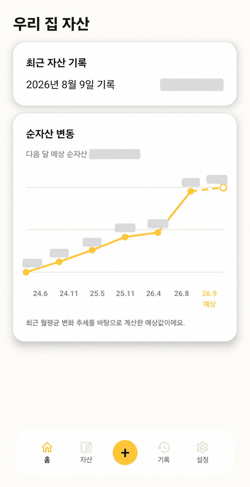
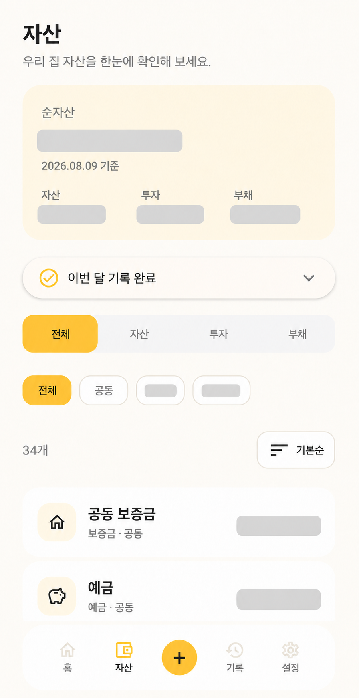
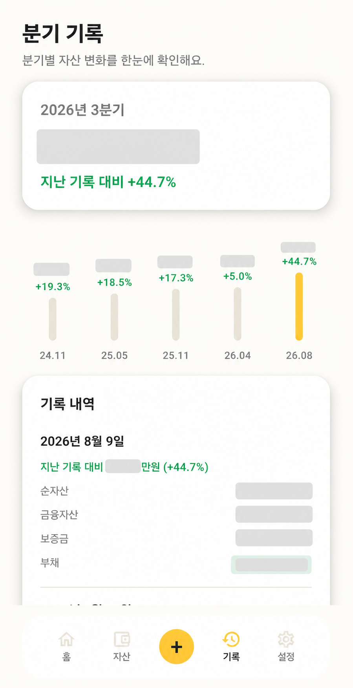
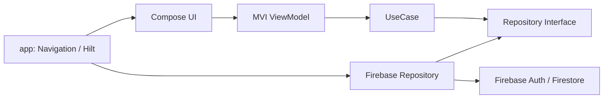
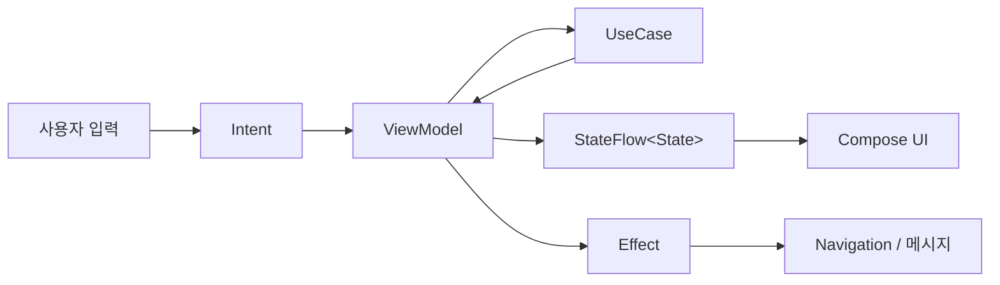

# moaZip

moaZip은 부부나 가족이 함께 우리 집 자산을 관리하고, 자산의 변화를 기록하는 Android 앱입니다.

매일 지출을 입력하는 가계부보다는 예금, 투자, 보증금, 부채 등 흩어진 자산을 한곳에 모으고 주기적으로 기록하여 우리 집의 순자산이 어떻게 달라지는지 확인하는 데 초점을 맞추고 있습니다.

## 앱 화면

<p align="center">
  
  &nbsp;&nbsp;
  
  &nbsp;&nbsp;
  
</p>

<p align="center">
  홈에서 순자산 변화를 확인하고, 자산 탭에서 우리 집 자산을 관리하며, 기록 탭에서 기간별 증감 내역을 확인할 수 있습니다.
</p>

## 주요 기능

- Google 계정을 이용한 로그인 및 자동 로그인
- 로그인 사용자의 Firestore 프로필 저장
- 우리 집 생성 및 초대 코드를 통한 파트너 참여
- 초대 코드 발급, 만료 및 재발급
- 구성원별 또는 공동 소유 자산 관리
- 자산 추가, 조회, 수정 및 삭제
- 소유자, 자산 분류 및 정렬 기준 필터
- 현재 자산 상태의 월별 스냅샷 기록
- 기록별 순자산, 금융자산, 보증금 및 부채 조회
- 지난 기록 대비 증감 금액과 증감률 표시
- 홈 순자산 추이와 다음 달 예상 순자산 표시
- 우리 집 정보와 구성원 조회 및 로그아웃

## 순자산 계산 기준

```text
금융자산 = 예금·적금·투자·퇴직금·청약·현금성 자산
총자산   = 금융자산 + 보증금 등 기타 자산
순자산   = 총자산 - 부채
수익금   = 현재 금액 - 원금
수익률   = 수익금 / 원금 × 100
```

## 기술 스택

- Kotlin
- Jetpack Compose
- Material 3
- Compose Navigation
- Coroutines, Flow, StateFlow
- MVI
- Clean Architecture
- Multi-module Architecture
- Hilt
- Firebase Authentication
- Cloud Firestore
- Credential Manager 및 Google ID

## 아키텍처

moaZip은 기능 중심 멀티모듈 구조에 클린 아키텍처의 의존성 원칙을 적용합니다. 화면은 Firebase 구현을 직접 사용하지 않고 UseCase와 Repository 인터페이스를 통해 데이터에 접근합니다.



의존성 방향은 다음과 같습니다.

```text
app ──→ feature ──→ core:domain ──→ core:model
 │                       ↑
 └────→ core:firebase ───┘
```

- `feature`는 화면과 사용자 상호작용을 담당합니다.
- `core:domain`은 Repository 인터페이스와 UseCase를 제공합니다.
- `core:firebase`는 Domain의 Repository 인터페이스를 구현합니다.
- `app`은 Hilt를 이용해 구현체를 연결하고 전체 Navigation을 구성합니다.

## 모듈 구성

```text
android/
├── app                         # Application, Navigation, Hilt 조립
├── core
│   ├── model                   # 공통 Domain 모델
│   ├── domain                  # Repository 인터페이스와 UseCase
│   ├── data                    # 향후 로컬 저장소와 데이터 조합 계층
│   ├── firebase                # Firebase Repository 구현
│   ├── presentation            # 공통 MVI 기반 클래스
│   └── ui                      # 디자인 시스템과 공통 Compose 컴포넌트
└── feature
    ├── auth                    # Google 로그인
    ├── partner                 # 우리 집 생성, 초대 및 참여
    ├── dashboard               # 홈 대시보드와 자산 추이
    ├── assets                  # 자산 목록, 추가, 수정 및 삭제
    ├── records                 # 월별 자산 기록
    ├── settings                # 우리 집 정보, 구성원 및 로그아웃
    ├── recurring               # 정기 자산 기능 확장 영역
    └── import                  # 자산 가져오기 기능 확장 영역
```

### Core 모듈

| 모듈 | 책임 |
| --- | --- |
| `core:model` | `Asset`, `AssetSnapshot`, `HouseholdMember` 등 공통 모델 |
| `core:domain` | 비즈니스 규칙, UseCase, Repository 인터페이스 |
| `core:firebase` | Firebase Auth와 Firestore 접근 및 모델 변환 |
| `core:presentation` | `UiState`, `UiIntent`, `UiEffect`, `MviViewModel` |
| `core:ui` | 색상, 타이포그래피, 버튼, 카드, 입력창, 하단 내비게이션 |
| `core:data` | 로컬 DB나 복합 DataSource 도입을 위한 확장 영역 |

### Feature 내부 구조

규모가 큰 Feature는 화면 단위로 한 번 더 나누고 동일한 패키지 규칙을 사용합니다.

```text
feature/assets/
├── addasset/
│   ├── contract/               # Intent, State, Effect, 오류 및 UI 모델
│   ├── route/                  # ViewModel 연결과 Effect 처리
│   └── ui/
│       └── component/          # 화면 전용 Composable
├── editasset/
├── assetlist/
└── assetform/                  # 추가와 수정이 공유하는 자산 폼
```

## MVI 흐름

각 화면은 단방향 데이터 흐름을 따릅니다.



- `Intent`: 버튼 클릭, 입력 변경, 새로고침 등 사용자 행동
- `State`: 로딩, 입력값, 선택값, 화면 데이터, 오류 상태
- `Effect`: 화면 이동이나 메시지처럼 한 번만 처리할 이벤트
- `reduce`: 기존 State를 바탕으로 새로운 State 생성

ViewModel은 `StateFlow`로 화면 상태를 노출하고, 일회성 Effect는 buffered `Channel`을 통해 전달합니다.

## 데이터 흐름 예시

자산을 추가할 때의 흐름은 다음과 같습니다.

```text
AddAssetScreen
    → AddAssetIntent.Submit
    → AddAssetViewModel
    → AddAssetUseCase
    → AssetRepository
    → FirebaseAssetRepository
    → Firestore households/{householdId}/assets/{assetId}
```

Firestore의 변경 사항은 `callbackFlow`를 통해 Flow로 변환되며, 자산 목록과 대시보드가 실시간으로 갱신됩니다.

## 화면 이동 구조

Navigation은 `app` 모듈에서 관리합니다.

- `AuthNavGraph`: 로그인
- `PartnerNavGraph`: 우리 집 생성, 파트너 초대, 초대 코드 참여
- `MainNavGraph`: 홈, 자산, 자산 추가·수정, 기록, 설정

로그인 상태와 Household 가입 여부에 따라 시작 화면을 결정합니다.

```text
앱 실행
├── 로그아웃 상태 → 로그인
└── 로그인 상태 → Household 확인
    ├── 가입됨 → 홈
    └── 가입되지 않음 → 우리 집 생성
```

## 프로젝트 구성

```text
android/                 Android 애플리케이션
docs/                    제품 기획, 데이터 모델 및 가져오기 명세
firestore.rules          Firestore 보안 규칙
firestore.indexes.json   Firestore 인덱스 설정
firebase.json            Firebase 배포 설정
web/                     향후 웹 대시보드 확장 영역
```

## 로컬 실행

### 요구 사항

- Android Studio 최신 안정 버전
- Android SDK
- JDK 17
- Firebase 프로젝트 접근 권한
- Google Play 서비스가 포함된 에뮬레이터 또는 Android 기기

### Firebase 설정

Firebase Console에서 Android 앱을 등록한 후 내려받은 `google-services.json`을 다음 위치에 추가합니다.

```text
android/app/google-services.json
```

Google 로그인을 사용하려면 Firebase Authentication에서 Google 제공업체가 활성화되어 있어야 하며, 앱의 SHA 인증서 지문도 Firebase 프로젝트에 등록해야 합니다.

### 빌드

```bash
cd android
./gradlew assembleDebug
```

## 향후 확장

- 정기 적금 및 반복 자산 관리
- XLSX 가져오기와 내보내기
- 자산 기록 상세 비교
- 로컬 캐시 및 오프라인 지원
- 읽기 중심 웹 대시보드
- 테스트 코드 및 CI 자동화
